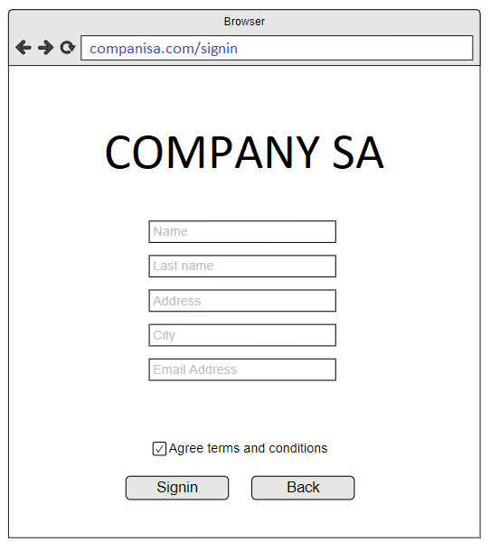
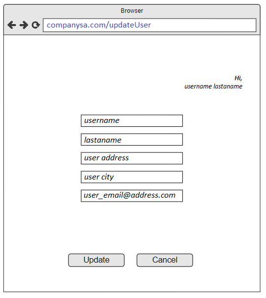
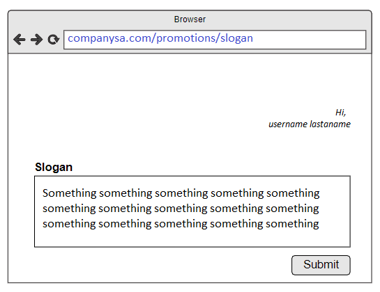

# CUSTOMER KATA

CompanySA is creating a new shop online and in order to get as much people enrolled as possible, every new registered
user will have access to new promotions, but they must deserve it, so they have to participate on a contest sharing the
best slogans they can imagine in order to get the prize. The first iteration consist on creating REST endpoints to
enable the following features:

1. Given a customer wants to get his/her deserved promotions they need to sign in to companysa.com. Just to give a clue
   on the data that need to be returned the front-end form would look as follows:
   

   In order to get customer trust we want to give as much transparency as possible logged customers can query its own
   details, to figure out what details CompanySA owns related to them.

2. Everybody can do mistakes, so we want to give flexibility to customers logged customers can modify all its details, (
   ie. mail). Second iteration will be to add the following features using REST:
   

3. A user can share slogans with CompanySA following these rules:

- Maximum of 3 slogans by registered customer
- if more than 3 slogans are sent by the same customer, CompanySA will reply back kindly letting him/her know the
  maximum number of slogans have been reached.

  

> TIPS:
> As you will see this feature is not covering all user journey, you don't need to implement the login. All the UI mocks
> are just to give you a reference about the request/response content, you don’t need to implement any sort of UI

# Assumptions

- I use an in-memory database.

# Architecture

- I use a hexagonal architecture with TDD, Clean Code, SOLID principles and KISS.
